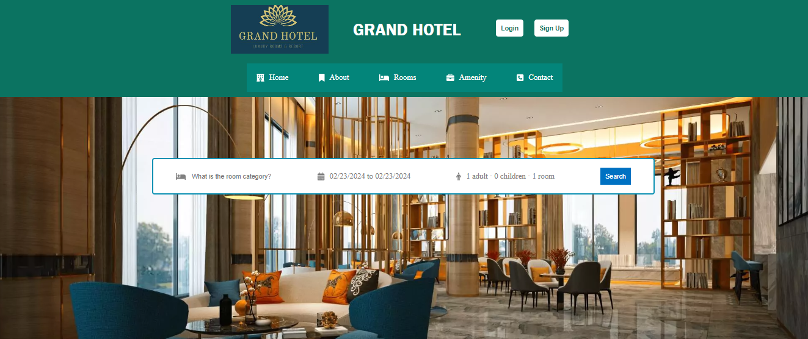

# MERN Hotel Reservation App

This full-stack hotel reservation application is built with the MERN (MongoDB, Express.js, React, Node.js) stack. It allows users to easily browse, filter, and book hotel rooms, with the added feature of uploading images for each room.
API - Insomnia
## Features

- **User Authentication:** Secure user authentication system with signup and login functionality.
- **Room Details:** Detailed information about each room, including images, amenities, and pricing.
- **Room Booking:** Users can easily book rooms for their desired dates.
- **Image Upload:** Admins can upload images for each room to enhance the user's visual experience.
- **Categorized Rooms:** Rooms are categorized for easy navigation and selection.
- **Filtering:** User-friendly filtering options based on preferences such as date, room type, and amenities.

 
 HOME SCREEN

-[do npm start for both api and hotel]
